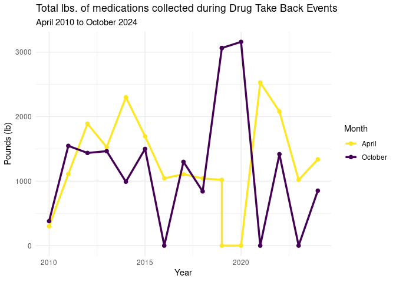
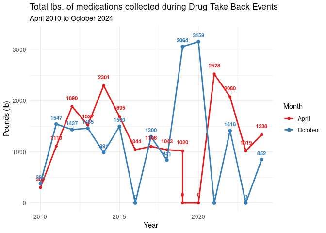
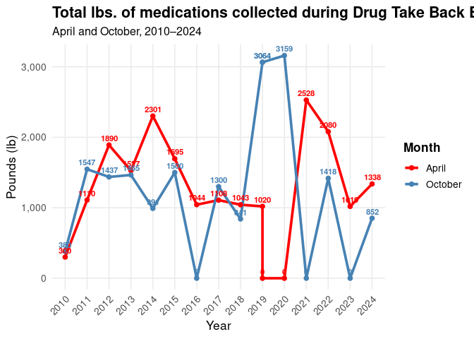

Project Data Work
================
Charlie-Liz-Noku

``` r
library(tidyverse)
library(broom)
```

``` r
smoked_data <- read.csv("/cloud/project/data/2009-2021_smoked_formatted.csv")
drug_data <- read.csv("/cloud/project/data/Total_drug_weight.csv")

colnames(drug_data) <- c("Year", "April", "October", "Total")

drug_data <- drug_data |>
  slice(-1)

#Make numeric
drug_data <- drug_data |>
  filter(Year != "totals") |>       
  mutate(Year = as.numeric(Year), 
         April = as.numeric(April),
         October = as.numeric(October),
         Total = as.numeric(Total))
```

    ## Warning: There was 1 warning in `mutate()`.
    ## ℹ In argument: `Year = as.numeric(Year)`.
    ## Caused by warning:
    ## ! NAs introduced by coercion

``` r
drug_without_total <- drug_data |>
  filter(Year != "totals")

ggplot(drug_without_total, aes(x = factor(Year))) +
  scale_fill_viridis_d(direction = -1) +
  geom_col(aes(y = April, fill = "April")) +
  geom_col(aes(y = October, fill = "October")) +
  labs(title = "Total lbs. of medications collected during Free Drug Take Back Events",
       subtitle = "April 2010 to October 2024",
       x = "Year", y = "Pounds (lb)", fill = "Month") +
  theme_minimal() +
  theme(axis.text.x = element_text(angle = 45, hjust = 1))
```

<!-- -->

``` r
ggsave("total_drug_weight.png")
```

    ## Saving 7 x 5 in image

``` r
ggplot(drug_without_total, aes(x = Year)) +
  geom_line(aes(y = April, color = "April"), size = 1.2) +
  geom_point(aes(y = April, color = "April"), size = 2) +
  geom_line(aes(y = October, color = "October"), size = 1.2) +
  geom_point(aes(y = October, color = "October"), size = 2) +
  scale_color_viridis_d(direction = -1) +
  labs(title = "Total lbs. of medications collected during Drug Take Back Events",
       subtitle = "April 2010 to October 2024",
       x = "Year", y = "Pounds (lb)", color = "Month") +
  theme_minimal()
```

    ## Warning: Using `size` aesthetic for lines was deprecated in ggplot2 3.4.0.
    ## ℹ Please use `linewidth` instead.
    ## This warning is displayed once every 8 hours.
    ## Call `lifecycle::last_lifecycle_warnings()` to see where this warning was
    ## generated.

<!-- -->

``` r
ggplot(drug_without_total, aes(x = Year)) +
  geom_line(aes(y = April, color = "April"), size = 1.0) +
  geom_point(aes(y = April, color = "April"), size = 1.5) +
  geom_line(aes(y = October, color = "October"), size = 1.0) +
  geom_point(aes(y = October, color = "October"), size = 2) +
  geom_text(aes(y = April, label = April, color = "April"), 
            vjust = -1.5, 
            size = 3, 
            fontface = "bold", 
            how.legend = FALSE) +
  geom_text(aes(y = October, label = October, color = "October"), 
            vjust = -1, 
            size = 3, 
            fontface = "bold", 
            show.legend = FALSE) +
  scale_color_brewer(palette = 6, type = "qual") +
  labs(title = "Total lbs. of medications collected during Drug Take Back Events",
       subtitle = "April 2010 to October 2024",
       x = "Year", y = "Pounds (lb)", color = "Month") +
  theme_minimal() +
  scale_y_continuous(limits = c(0, 3300))
```

    ## Warning in geom_text(aes(y = April, label = April, color = "April"), vjust =
    ## -1.5, : Ignoring unknown parameters: `how.legend`

<!-- -->

``` r
ggsave("plot_review2.png")
```

    ## Saving 7 x 5 in image

``` r
library(tidyverse)

# Pivot data longer for ggplot
drug_long <- drug_without_total %>%
  pivot_longer(cols = c("April", "October"),
               names_to = "Month",
               values_to = "Pounds")

# Plot
ggplot(drug_long, aes(x = factor(Year), y = Pounds, group = Month, color = Month)) +
  geom_line(size = 1.3) +
  geom_point(size = 2) +
  geom_text(aes(label = Pounds), 
            vjust = -0.6, 
            fontface = "bold", 
            size = 3, 
            show.legend = FALSE) +
  scale_color_manual(values = c("April" = "red", "October" = "steelblue")) +
  labs(
    title = "Total lbs. of medications collected during Drug Take Back Events",
    subtitle = "April and October, 2010–2024",
    x = "Year", y = "Pounds (lb)", color = "Month"
  ) +
  scale_y_continuous(labels = scales::comma) +
  theme_minimal(base_size = 13) +
  theme(
    axis.text.x = element_text(angle = 45, hjust = 1),
    plot.title = element_text(face = "bold", size = 16),
    plot.subtitle = element_text(size = 12),
    legend.title = element_text(face = "bold"),
    panel.grid.minor = element_blank()
  )
```

<!-- -->
