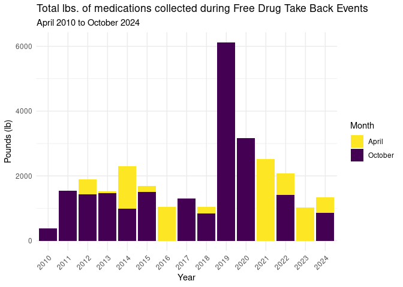

Project Data Work
================
Charlie-Liz-Noku

``` r
library(tidyverse)
library(broom)
```

``` r
smoked_data <- read.csv("/cloud/project/data/2009-2021_smoked_formatted.csv")
drug_data <- read.csv("/cloud/project/data/Total_drug_weight.csv")

colnames(drug_data) <- c("Year", "April", "October", "Total")

drug_data <- drug_data |>
  slice(-1)

#Make numeric
drug_data <- drug_data |>
  filter(Year != "totals") |>       
  mutate(Year = as.numeric(Year), 
         April = as.numeric(April),
         October = as.numeric(October),
         Total = as.numeric(Total))
```

    ## Warning: There was 1 warning in `mutate()`.
    ## ℹ In argument: `Year = as.numeric(Year)`.
    ## Caused by warning:
    ## ! NAs introduced by coercion

``` r
drug_without_total <- drug_data |>
  filter(Year != "totals")

ggplot(drug_without_total, aes(x = factor(Year))) +
  scale_fill_viridis_d(direction = -1) +
  geom_col(aes(y = April, fill = "April")) +
  geom_col(aes(y = October, fill = "October")) +
  labs(title = "Total lbs. of medications collected during Free Drug Take Back Events",
       subtitle = "April 2010 to October 2024",
       x = "Year", y = "Pounds (lb)", fill = "Month") +
  theme_minimal() +
  theme(axis.text.x = element_text(angle = 45, hjust = 1))
```

<!-- -->

``` r
ggsave("total_drug_weight.png")
```

    ## Saving 7 x 5 in image
